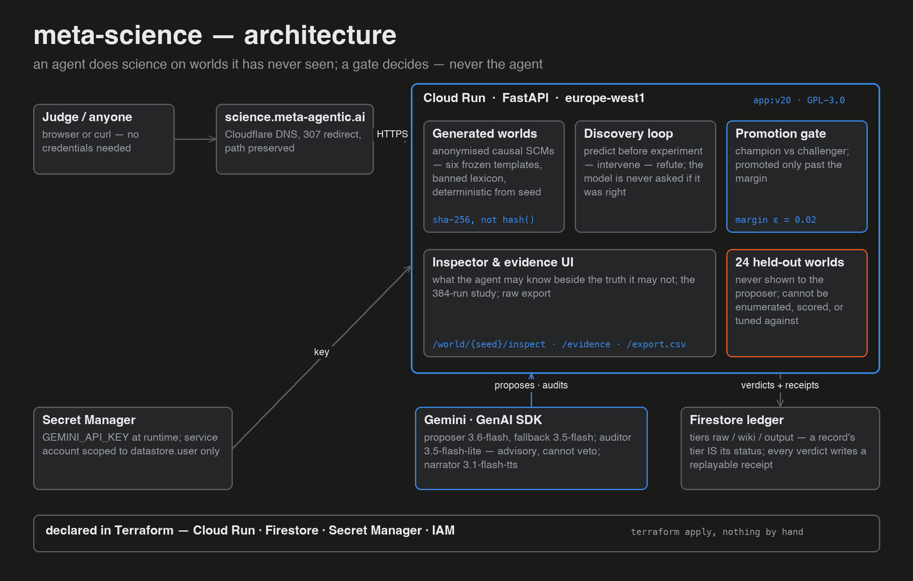
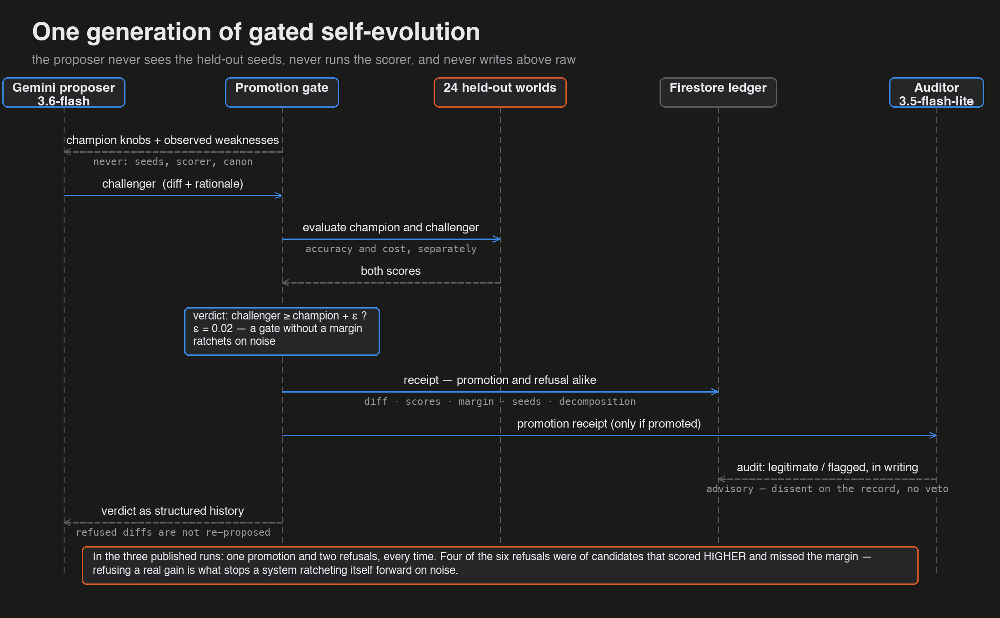
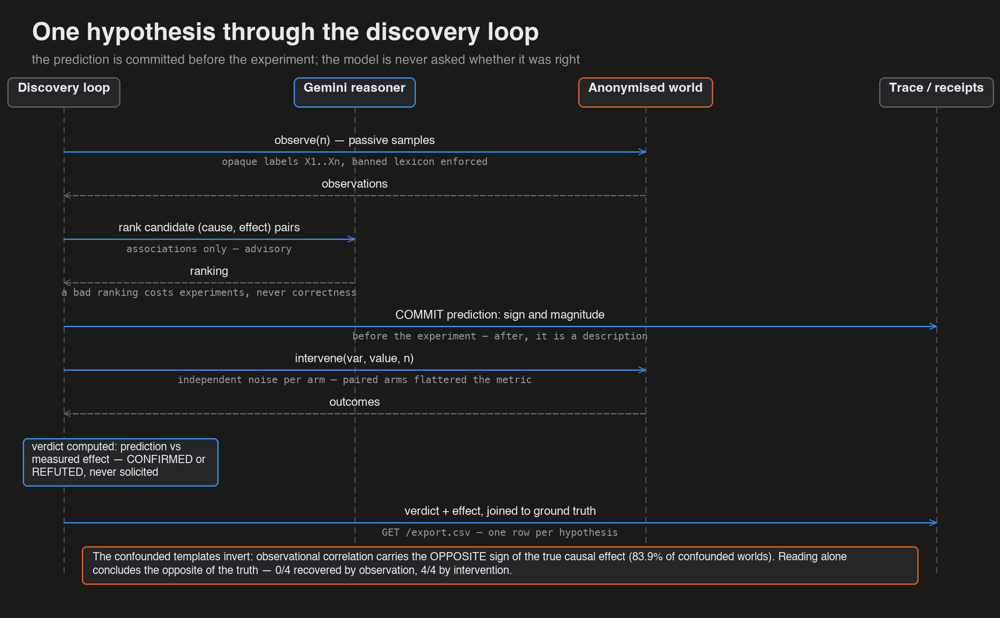

# Architecture

One request path, one decision path, and a boundary between them.

**The request path.** `science.meta-agentic.ai` (Cloudflare DNS, 307 redirect,
path preserved) fronts a Cloud Run service — FastAPI, `europe-west1`,
scale-to-zero, public by design: judges need no credentials. The service carries
the generated worlds, the discovery loop, the promotion gate, and the static
inspector/evidence UI.

**The decision path.** Gemini, through the GenAI SDK, holds exactly two narrow
roles: the proposer (`gemini-3.6-flash`, falling back to `3.5-flash`) suggests
experiments and method changes; the auditor (`gemini-3.5-flash-lite` — a
different model on purpose) reads each promotion receipt and may dissent on the
record, without veto. Neither ever sees the 24 held-out seeds, runs the scorer,
or writes above the `raw` tier. A third Gemini role exists outside the loop
entirely: the TTS narrator (`gemini-3.1-flash-tts`, voice Kore) that voices the
demo video.

**The ledger.** Firestore holds three tiers — `raw`, `wiki`, `output` — and a
record's tier *is* its status: nothing is promoted by assertion, only by moving
up. Every verdict, promotion and refusal alike, writes a receipt carrying the
diff, both scores, the margin, the score decomposition and the held-out seeds —
enough to recompute the decision independently.

**The plumbing.** The API key lives in Secret Manager and reaches the container
at runtime; the service account is scoped to `roles/datastore.user` and nothing
else. All of it is declared in Terraform (`infra/main.tf`) — Cloud Run,
Firestore, Secret Manager, IAM — with the database on an `ABANDON` deletion
policy so a `terraform destroy` cannot take the evidence with it.

## The two sequences that matter

**One generation of gated self-evolution** — who may say what to whom, and what
the proposer never sees:

**One hypothesis through the discovery loop** — the prediction committed before
the experiment, and a verdict computed rather than asked:

All three images are generated by
[`scripts/architecture_diagram.py`](../scripts/architecture_diagram.py) and
[`scripts/sequence_diagram.py`](../scripts/sequence_diagram.py) in the demo
video's palette — deterministic, like everything else here.
