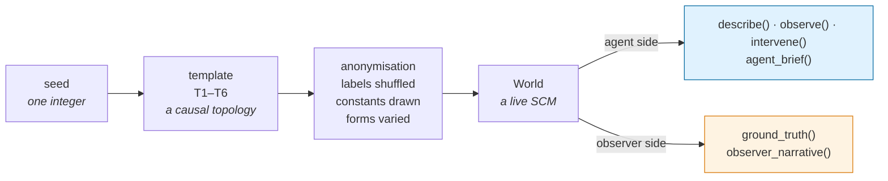
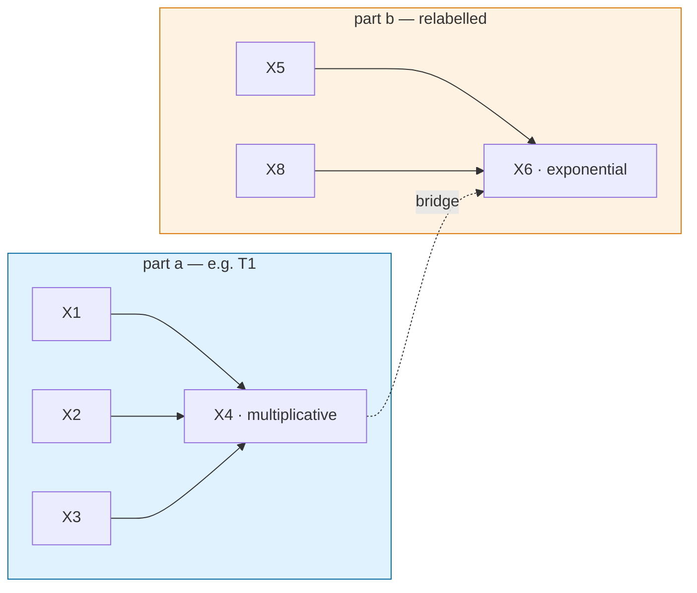

# The mini-world generator

How a world comes to exist, what it is made of, and why every design choice serves one
requirement: **the agent must be able to discover, and unable to retrieve.**

## The pipeline: seed → template → anonymisation → world



Everything derives from the seed through a stable hash (`hashlib`, not Python's
process-randomised `hash()` — that distinction cost us a real bug), so the same seed
builds bit-identical worlds in every process. A run is replayable from its seed list
alone, which is what makes the receipts checkable.

## What a world is made of — the AST

A world is a flat DAG of `Node`s. Each node is either **exogenous** (pure noise with a
mean and sd) or carries a `Mechanism`: a functional family plus per-parent coefficients,
a constant, and observation noise.

```
World
 ├─ nodes: {name → Node}
 │    ├─ parents: (names…)
 │    └─ mechanism: Mechanism(form, coeffs, const, noise) | None
 ├─ observable: (names…)      # what the agent may see and set
 └─ hidden: (names…)          # confounders — sampled, never exposed
```

Four mechanism families: `linear`, `multiplicative` (product of powers),
`exponential`, `saturating`. Every family accepts any number of parents, which is the
property that later makes composition free.

**Templates are just fixed topologies** seeded from real science — a state relation, a
kinetics-shaped response, a transport chain, a compartment flow, pure confounding, and
the sign-inverting confounded pair. Real science donates non-trivial structure and
known ground truth; anonymisation strips everything retrievable: labels shuffle per
world, constants and exponents draw per seed, the functional family varies. The
41-term banned lexicon plus a structure lexicon are asserted by test against everything
the agent can see.

## The two views, and why prose is the dangerous one

Ask for a world in words and there are **two different answers**, and they must never
come from the same function:

| | `agent_brief()` | `observer_narrative()` |
|---|---|---|
| audience | the agent, or a page's agent panel | humans studying the benchmark |
| content | labels, affordances, the task — *nothing else* | topology, families, weights, what the confounder does |
| guard | domain + structure lexicons, by test | unimportable from agent modules, by test |

Prose leaks structure more easily than JSON: "X3 responds *exponentially* to X1" names
the law's family, which is precisely what the surface withholds — a model told the
family retrieves the law instead of discovering it. So the two views are separate
functions rather than one function with a flag: a flag can be passed wrongly at a call
site, and the cost of that mistake is the benchmark.

The narrative is honest about the traps: on pure confounding (T5) it says the two
observables "correlate without either causing the other"; on the inverting template
(T6) it says the passive correlation "can even carry the opposite sign to the true
effect" — because there the confounder sits *on top of* a real edge, which is a
different lie than T5 tells.

## Visual parametrisation — `/world/{seed}/inspect`

The inspector renders any seed with a **diagram / prose / JSON** switch — and the two
sides of the page reproduce the code's boundary:

- **Agent surface** (blue): the labels and the brief. Deliberately no graph is drawn in
  this panel — edges there would grant the view the very thing the agent does not have.
- **Observer truth** (orange): the layered DAG (hidden confounders dashed), the
  narrative, the ground-truth JSON.

Truth is public on purpose. Anyone with the public repo can compute it from the seed,
so secrecy is not what protects the benchmark; the boundary is process-level — nothing
on the agent's path calls `ground_truth()` or the `/truth` endpoint — and anonymisation
guards against retrieval from training, not against a person reading the answer.

## Scope note: "seeing is not doing" and the quantum objection

Axiom A2 invites a physicist's objection: in quantum mechanics there is no passive
spectator — observation is physical interaction. The objection lands on the slogan and
misses the substance. A2's formal content is Pearl's distinction between *conditioning*
and *intervening* — P(Y|X) versus P(Y|do(X)) — and that distinction survives quantum
mechanics intact: conditioning on a measurement outcome is post-selection, intervening
is state preparation, and no interpretation of QM collapses the two into one operation.

What the observer effect does say is that the idealized zero-back-action `observe()`
does not physically exist at the quantum scale — every observation carries a small
`do()` inside it. Our worlds are classical structural causal models, where a
disturbance-free observation is not an assumption but a construction. The axiom is
scoped to that regime, and the boundary is stated rather than hidden.

It is also a roadmap item rather than a vulnerability: "measurement disturbs"
translates directly into this AST as *an edge from the act of observing into the
system*. A future world family adds observation back-action — each `observe(n)` nudges
the state by ε — and the agent must discover that its own looking is weakly acting.
Disentangling measurement disturbance from dynamics is exactly the kind of problem
this benchmark exists to pose.

## Compound worlds — yes, with the AST as it stands

The question "can the generator produce compound problems?" has a short answer: the
AST already supports it, because a world is a DAG and every mechanism family takes
arbitrary parents. `compose(a, b, seed)`:

1. **Relabels** b's nodes past a's highest index (hidden nodes included), so labels
   never collide and stay anonymous.
2. **Unions** the node sets.
3. **Bridges**: adds 1–2 edges from a's observables into b's mechanism nodes, with
   coefficients drawn from the same range templates use — a seam that is not
   statistically recognisable as a seam.

Bridges run in one direction only, so acyclicity is free (each part was a DAG and no
edge returns); the constructor's cycle guard still checks. `generate_compound(seed)`
derives both templates, both sub-seeds and the bridges from one integer, so compounds
are as replayable as atoms.



What compounds buy: **difficulty scales without new templates.** An agent that handles
T2 and T6 separately faces genuinely new work when a T2 quantity feeds the confounded
pair — more variables, longer paths, colliders across the seam — while every audited
property (anonymisation, determinism, hidden-stays-hidden, the discovery loop running
unchanged) is asserted by `tests/test_compose.py` rather than assumed.

Compounds chain: `generate_compound(seed, depth)` folds composition left, so depth *n*
is *n+1* templates (depth 0 is the atomic world through the same code path, and the API
caps depth at 7 server-side — a cap that exists only in the UI is not a cap). A depth-7
chain — 28 observables, hidden confounders intact — passes the same invariant suite as
an atom and the discovery loop runs on it unchanged.

Current limits, stated: bridges are a→b only (no merging of a shared variable, no
bidirectional coupling — both would need a cycle check smarter than "one direction");
and the held-out benchmark still runs on atomic worlds — promoting a strategy on
compound evidence is future work, not a claim.
